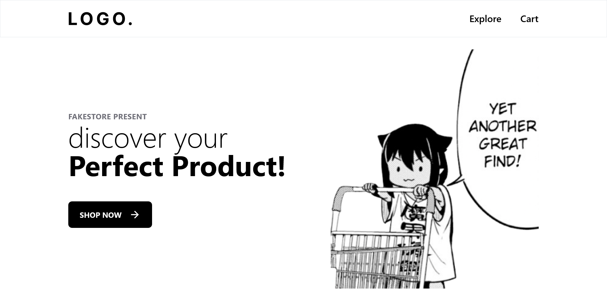

# Shopping Cart

This project is assigned by TheOdinProject. For more information, please refer to [their curriculum](https://www.theodinproject.com/lessons/node-path-react-new-shopping-cart).

A humble small online shopping website where you can discover your perfect product.

## Preview



## Feature

- All the most basic function of a online shopping website you can think of.

## Build your own shop

1. Clone and install required packages to local machine

```bash
git clone https://github.com/69kwan69/shopping-cart.git
cd ./shopping-cart
npm install
```

2. Ask yourself why would you want to store more trash on your computer.

## My ~~Rant~~ Thought

In this project, I've learnt how to use TailwindCSS and `react-router-dom` library. A bit about Tailwind, it provides a new approach to fast styling by integrating the rules as class that you can use instantly instead of putting them in a separated file. Tailwind helps me work with CSS really fast and efficient without having to concern the naming part. This is a big advantage over that of CSS Module thingy, where you have to add more complexity just to avoid naming classes. Its only small disadvantage is the code would be ugly. I think in the future project, I'll stick with Tailwind. Aside About `react-router-dom`, it's like learning a new framework because of their approaches to routing and manipulating fetched data is totally different from that of _vanilla React_. The URL routing is pretty easy to understand, until the form and its methods come to play (for data mutation stuff). After thorough consideration, I've arrived to the conclusion, _forget it, I have `useContext`_.


